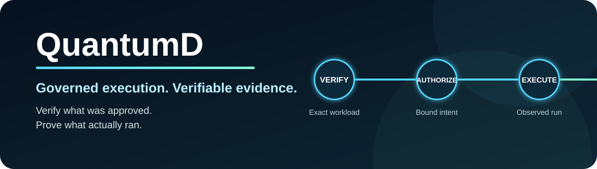
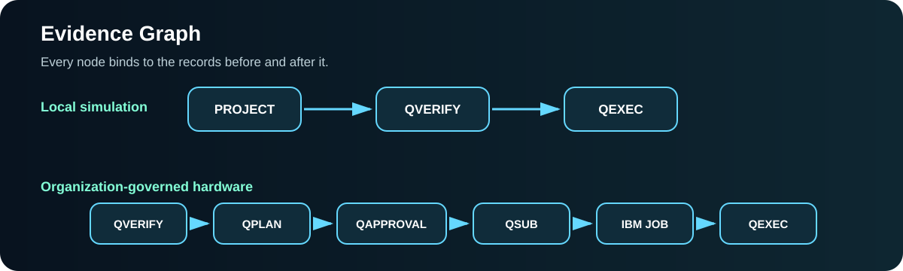
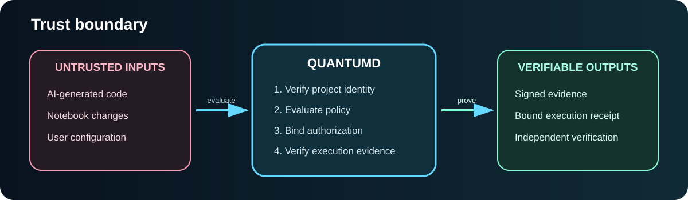

<p align="center">
  
</p>

<p align="center">
  <a href="https://github.com/WindDAnalytics/quantumd/actions/workflows/ci.yml">
    
  </a>
  <a href="https://github.com/WindDAnalytics/quantumd/actions/workflows/docs.yml">
    
  </a>
  <a href="https://www.python.org/">
    
  </a>
  <a href="LICENSE">
    
  </a>
  <a href="CHANGELOG.md">
    
  </a>
</p>

<p align="center">
  <strong>QuantumD produces trustworthy execution evidence, not favorable quantum results.</strong>
</p>

QuantumD is the trust and execution layer for AI-generated quantum software.
It verifies the exact workload, enforces execution policy, binds authorization
to what actually runs, and produces evidence that can be checked independently.

You do not need a quantum computer, an IBM Quantum account, or a Google Cloud
account to explore the local evidence model. The public alpha starts with a
simulator-only workflow whose hardware authority is explicitly prohibited.

<p align="center">
  <a href="#run-the-public-alpha"><strong>Run the alpha</strong></a>
  ·
  <a href="#choose-your-path"><strong>Choose your path</strong></a>
  ·
  <a href="#documentation-map"><strong>Browse the docs</strong></a>
  ·
  <a href="docs/alpha-evaluation.md"><strong>Join the evaluation</strong></a>
</p>

## Choose your path

QuantumD is designed for different kinds of readers. Start with the route that
matches your role or question.

| You are exploring QuantumD as... | Start here | Continue with |
|---|---|---|
| A first-time reader | [Public alpha installation](docs/getting-started/installation.md) | [Local quickstart](docs/getting-started/quickstart.md) |
| A quantum developer | [Evidence Graph](docs/concepts/evidence-graph.md) | [IBM Quantum workflow](docs/providers/ibm-quantum.md) |
| A security or DevSecOps engineer | [Trust boundary](docs/concepts/trust-boundary.md) | [Verify an evidence chain](docs/guides/verifying-a-chain.md) |
| A reviewer, auditor, or program leader | [What the Evidence Graph records](docs/concepts/evidence-graph.md) | [v0.7.4 alpha release](docs/releases/v0.7.4-alpha.md) |
| An educator, researcher, or advanced student | [Local simulation](docs/guides/local-simulation.md) | [Alpha evaluation](docs/alpha-evaluation.md) |
| A contributor | [Contributing guide](CONTRIBUTING.md) | [Roadmap](docs/roadmap.md) |
| A security researcher | [Security policy](SECURITY.md) | [Support boundaries](SUPPORT.md) |

## Why QuantumD exists

AI can generate circuits, notebooks, and computational workflows quickly.
That does not establish that:

- the reviewed workload is the workload that executed
- an approval was used only for its intended project and parameters
- a submitted job identifier belongs to the approved workload
- a returned result has not been substituted or altered
- the evidence chain can be checked without trusting the original platform

QuantumD places a governed verification boundary between generated software
and execution. It connects reviewer intent, cryptographic authorization,
provider submission, observed execution, result artifacts, and signed receipts.

## What QuantumD proves

QuantumD binds together:

- project source and manifest identity
- the verification and policy decision
- the authorized backend and shot count
- logical and executed circuit identities
- approval, submission, job, and execution identifiers
- the result artifact and its SHA-256 digest
- the execution receipt
- signing-key lineage
- the order of authorization and execution

A successful job identifier or a complete cloud log is useful, but it is not
the same as a verified chain connecting approval to execution and results.

## Run the public alpha

QuantumD `0.7.4a0` is published on TestPyPI. Use an isolated Python environment
and download only the QuantumD wheel from TestPyPI. Dependencies are installed
from the default Python Package Index.

### 1. Create a supported isolated environment

The recommended Linux and WSL path uses `uv`, so the setup does not depend on
the operating system's default Python or `venv` package:

```bash
curl -LsSf https://astral.sh/uv/install.sh | sh
export PATH="$HOME/.local/bin:$PATH"

uv python install 3.12
uv venv --python 3.12 --seed ~/.venvs/quantumd-alpha
source ~/.venvs/quantumd-alpha/bin/activate
python --version
```

QuantumD supports Python 3.10 and newer. Python 3.12 is the reference alpha
environment. Users who already have a supported Python and working `venv` may
use the standard-library environment path described in the
[installation guide](docs/getting-started/installation.md).

### 2. Download and verify the exact wheel

```bash
python -m pip download \
  --no-deps \
  --only-binary=:all: \
  --index-url https://test.pypi.org/simple/ \
  quantumd==0.7.4a0

echo \
  "761a865a5aaf655f570fa3ae6f1d0f9b1b09cb89ee5519ac1843b738d251b7d2  quantumd-0.7.4a0-py3-none-any.whl" \
  | sha256sum --check
```

### 3. Install and run the local workflow

```bash
python -m pip install \
  ./quantumd-0.7.4a0-py3-none-any.whl

quantumd quickstart my-first-quantumd-project
```

### 4. Inspect and independently verify the evidence

```bash
quantumd doctor my-first-quantumd-project

quantumd verify-chain \
  my-first-quantumd-project \
  --latest
```

The local quickstart is intentionally restricted:

```text
Trust mode:             LOCAL_DEVELOPMENT
Trust scope:            LOCAL_SIMULATION_ONLY
Hardware authorization: PROHIBITED
KMS signing used:       False
IBM contacted:          False
Hardware action:        None
```

Independent verification should finish with:

```text
[STATUS] COMPLETE EVIDENCE CHAIN VERIFIED
IBM contacted:   False
KMS contacted:   False
Hardware action: None
```

For expanded instructions, the guided bootstrap, WSL troubleshooting,
checksum details, and source development installation, see the
[installation guide](docs/getting-started/installation.md) and
[platform-support matrix](docs/getting-started/platform-support.md).

## The Evidence Graph

<p align="center">
  
</p>

The local workflow produces:

```text
PROJECT -> QVERIFY -> QEXEC
```

An organization-governed hardware workflow extends the chain:

```text
QVERIFY -> QPLAN -> QAPPROVAL -> QSUB -> IBM JOB -> QEXEC
```

Independent verification checks signatures, key lineage, authorization
binding, current source identity, circuit identity, result hashes, shot
counts, and execution timing. A local chain can be verified without contacting
IBM or Google Cloud KMS.

Read the complete [Evidence Graph guide](docs/concepts/evidence-graph.md).

## The trust boundary

<p align="center">
  
</p>

QuantumD treats generation and governed execution as separate security domains:

1. Code, notebooks, and configuration begin outside the trusted boundary.
2. QuantumD establishes the exact project and workload identity.
3. Policy determines what is permitted.
4. Authorization is bound to the verified workload.
5. Execution and result evidence are checked against that authorization.
6. Missing, mismatched, replayed, substituted, or corrupted evidence causes
   denial rather than best-effort acceptance.

A local-development identity can authorize Aer simulation only. It cannot
silently become hardware authority.

Read the [trust-boundary guide](docs/concepts/trust-boundary.md).

## Trust modes

| Trust mode | Available | Signing authority | Hardware authority |
|---|---:|---|---|
| `UNCONFIGURED` | Yes | None | Prohibited |
| `LOCAL_DEVELOPMENT` | Yes | Project-local identity | Prohibited |
| `KMS_GOVERNED` | Yes | Organization-controlled Google Cloud KMS | Policy controlled |
| `SELF_MANAGED_HARDWARE` | Planned | User-managed encrypted identity | Not yet available |

The local alpha is safe to explore without cloud credentials because
`LOCAL_DEVELOPMENT` is limited to `LOCAL_SIMULATION_ONLY`.

Read [Trust modes](docs/concepts/trust-modes.md) for the complete boundaries.

## Documentation map

### Start and operate

| Document | What it helps you do |
|---|---|
| [Installation](docs/getting-started/installation.md) | Install the exact public-alpha wheel or create a source-development environment |
| [Local quickstart](docs/getting-started/quickstart.md) | Create a governed simulator project and verify its evidence |
| [Local simulation](docs/guides/local-simulation.md) | Understand the simulator-first workflow |
| [Verify an evidence chain](docs/guides/verifying-a-chain.md) | Independently inspect the latest execution chain |
| [CLI reference](docs/reference/cli.md) | Find commands, options, and expected behavior |

### Understand the model

| Document | What it explains |
|---|---|
| [Evidence Graph](docs/concepts/evidence-graph.md) | How verification, plans, approvals, submissions, jobs, and receipts connect |
| [Trust boundary](docs/concepts/trust-boundary.md) | What remains untrusted and what must happen before execution is accepted |
| [Trust modes](docs/concepts/trust-modes.md) | Local, unconfigured, KMS-governed, and planned trust scopes |
| [IBM Quantum provider](docs/providers/ibm-quantum.md) | The controlled organization-governed hardware path |

### Evaluate, contribute, and govern

| Document | What it is for |
|---|---|
| [Alpha evaluation](docs/alpha-evaluation.md) | Test the stranger experience and provide structured feedback |
| [Evaluator worksheet](ALPHA_TESTING.md) | Record installation time, confusion, skepticism, and next-use cases |
| [v0.7.4 alpha release](docs/releases/v0.7.4-alpha.md) | Review the published alpha, checksum, and validated boundaries |
| [Security policy](SECURITY.md) | Report vulnerabilities privately and understand security-sensitive areas |
| [Contributing](CONTRIBUTING.md) | Set up development and preserve fail-closed behavior |
| [Support](SUPPORT.md) | Choose the correct public or private support channel |
| [Code of Conduct](CODE_OF_CONDUCT.md) | Participate professionally and respectfully |
| [Roadmap](docs/roadmap.md) | See the current direction without treating planned work as shipped |
| [Changelog](CHANGELOG.md) | Review version-by-version changes |

## Inclusive evaluation

QuantumD welcomes feedback from people with different technical backgrounds.
You do not need production quantum-hardware access to participate.

The first evaluation cohort is intended to include:

- a quantum developer
- a software-supply-chain or security engineer
- an ML, data, or scientific-computing engineer
- a technical leader from an audit-exposed environment
- an educator, researcher, or advanced technical student

The evaluation asks a simple question:

> Can a technically capable stranger install QuantumD, understand the trust
> boundary, produce a verified chain, and identify a real workflow where the
> evidence would matter?

Start with the [alpha-evaluation guide](docs/alpha-evaluation.md).

## Current alpha boundaries

QuantumD is alpha software. The current release demonstrates a governed local
workflow and an existing organization-managed KMS and IBM execution path.

QuantumD does not claim that:

- passing verification proves scientific usefulness
- a simulator result guarantees hardware performance
- a local signing identity is suitable for organization-controlled production
- every provider or computational framework is supported
- alpha software should be the sole control for classified, safety-critical,
  regulated, or financially material operations

Pin exact versions during evaluation and preserve evidence with the version
that generated it.

## Community and security

- Use [GitHub Issues](https://github.com/WindDAnalytics/quantumd/issues) for
  reproducible bugs, installation failures, documentation errors, and feature
  proposals.
- Follow [SECURITY.md](SECURITY.md) for vulnerabilities. Do not publish
  credentials, private keys, confidential evidence, or exploit details in a
  public issue.
- Read [CONTRIBUTING.md](CONTRIBUTING.md) before changing signing,
  authorization, trust selection, evidence verification, hardware access, or
  release workflows.
- Community participation is governed by the
  [Code of Conduct](CODE_OF_CONDUCT.md).

## Release provenance

The current public alpha is `v0.7.4-alpha`, published as Python package version
`0.7.4a0`.

- Release notes: [v0.7.4 alpha](docs/releases/v0.7.4-alpha.md)
- Package checksum:
  `761a865a5aaf655f570fa3ae6f1d0f9b1b09cb89ee5519ac1843b738d251b7d2`
- Website: [quantumd.ai](https://quantumd.ai)
- License: [Apache License 2.0](LICENSE)

QuantumD was founded and is maintained by Damarcus Thomas, founder@quantumd.ai.
